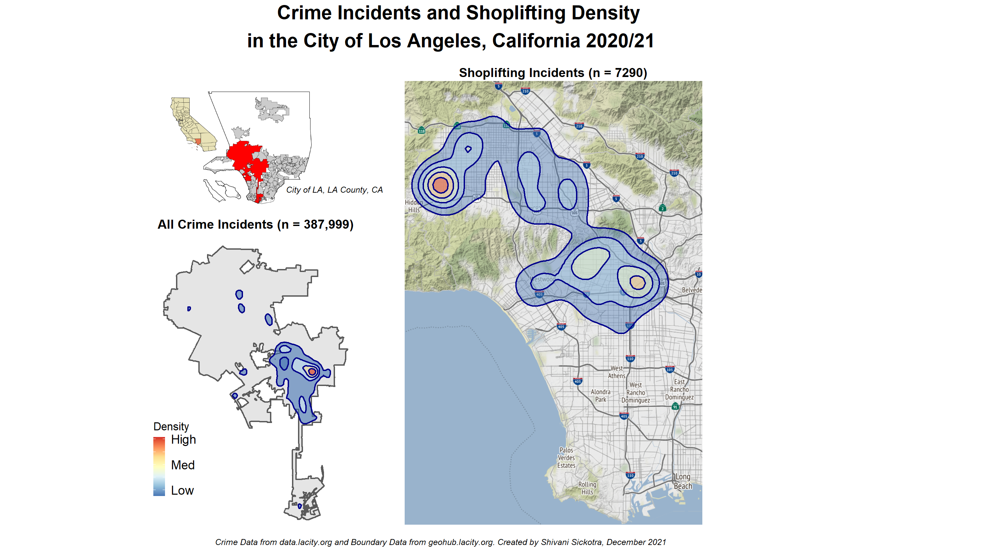

```{r setup, include=FALSE}
knitr::opts_chunk$set(echo = TRUE, warning = FALSE, message = FALSE)
```

```{r echo=TRUE}
# Load the required packages
library(sf) #for spatial data
library(ggplot2) #for plotting
library(dplyr) #for data manipulation
library(RColorBrewer) #for diverging colour scheme
library(tidyverse) #for piping
library(ggmap) #for creating maps
library(png) #for importing inset map image
library(magick) #for adding inset image
library(ggpubr) #for multi-plot figures
library(cowplot) # for multi-plot figures
library(knitr) # for including graphics
```

## 1 Import LA Boundary and Crime Data
```{r}
# Import the LA Shapefile using st_read 
LA <- st_read("Geo_Vis_2_Data/LA_County_City_Boundaries/LA_County_City_Boundaries.shp",
              stringsAsFactors = FALSE)

# Check CRS of the LA shapefile
#st_crs(LA)  # CRS is WGS 84, EPSG 4326

# View attribute table of the LA shapefile
#View(LA) 
```

```{r}
# Import the LA Crime Data
# https://data.lacity.org/Public-Safety/Crime-Data-from-2020-to-Present/2nrs-mtv8
# Feb 2020 to present (15/12/21)
LAcrime <- read.csv("Geo_Vis_2_Data/LA_Crime_Data_from_2020_to_Present.csv")

# View the imported dataframe
# Each observation/row is a crime incident that has occurred
#View(LAcrime)
#str(LAcrime) # see datatypes of each column 
```

## 2 Pre-process the Data

### 2.1 LA Crime Data
```{r}
# Deal with missing coord data in the LAcrime dataframe
# Select the observations where LON does NOT have 0 values OR LAT does NOT have 0 values
LAcrime <- LAcrime %>% filter(LON != 0 | LAT != 0)   # remaining 387,999 obs
```

### 2.2 City of LA Boundary Data
```{r}
# Extract only the City of LA boundary from the LA county
# Use filter from dplyr to select only the City of Los Angeles area
LA_city <- filter(LA, CITY_LABEL == "Los Angeles")

# View the geometry type of the shapefile
#st_geometry_type(LA_city)
```

## 3 Explore Various Density Plotting Methods with LA Crime Data

### 3.1 Hex Binning 
```{r}
# Plot the City of Los Angeles geometry using ggplot
ggplot() +
  # Add the LA boundary shapefile
  geom_sf(data=LA_city) +
  # Add the crime point data +
  #geom_point(data=LAcrime, mapping = aes(x=LON, y=LAT), color="red") +
  # Add hex binned layer
  geom_hex(data=LAcrime,
           mapping = aes(x=LON, y=LAT), bins=15, color="black")+
  scale_fill_fermenter(n.breaks=10,palette = "RdYlBu")+
  # No theme to remove lat/long coord axis
  theme_void()
```


### 3.2 Rectangle binning (using geom_bin_2d)
```{r}
ggplot() +
  # Divide plane into rectangles and count number of cases in each
  geom_bin_2d(data=LAcrime, 
              mapping = aes(x=LON, y=LAT)) +
  # No theme to remove lat/long coord axis
  theme_void()
```


### 3.3 2D Kernel Density Estimate 
```{r}
ggplot() +
  # Add the LA city boundary
  geom_sf(data=LA_city) +
  # Calculate 2D kernel density estimate and plot the contours
  geom_density_2d(data=LAcrime,
                  mapping = aes(x=LON, y=LAT)) +
  # No theme to remove lat/long coord axis
  theme_void()
```


* Measuring the density of the crime incidents using hex bins is informative, however does not look visually appealing.

* Rectangle binning is also helpful, however the plot looks over-crowded.

* Using the 2D Kernel Density Estimate (KDE) provides a better perspective on the crimes as it is a generalisation of the former two methods. 

## 4. Create City of LA Crime Incidents and Shoplifting 2D KDE Geo-Visualisation

### 4.1 Create 2D KDE Map for All LA Crimes
```{r}
# Plot the City of Los Angeles geometry using ggplot
map1<- ggplot() +
  # Add LA city boundary
  geom_sf(data=LA_city) +
  # 2D KDE and plot contours
  stat_density_2d(data=LAcrime,
                  geom = "polygon",
                  contour = TRUE,
                  aes(x=LON, y=LAT, fill = after_stat(level)),
                  # Make transparent
                  alpha = 0.6,
                  # Contour line colour
                  colour = "darkblue",
                  # 5 bins used as this map will be smaller in main geovis
                  bins = 5) +
  # Use colour-blind friendly colour palette and format legend labels
  scale_fill_distiller(palette = "RdYlBu", direction = -1,
                       breaks = c(20, 30, 40, 50, 60),
                       labels = c("Low","","Med","","High"),
                       name = "Density") +
  # No theme to remove lat/long coord axis
  theme_void() +
  # Add plot title
  ggtitle("All Crime Incidents (n = 387,999)") +
  # Legend and title formatting
  theme(legend.position = c(0.10, 0.25),
        legend.title = element_text(size=8),
        legend.key.size = unit(0.3, "cm"),
        plot.title = element_text(size=9, face="bold",hjust = 0.5, vjust= 1.5),
        plot.margin = rep(unit(0,"null"),4),
        panel.spacing = unit(0,"null"))

map1
```


### 4.2 Create 2D KDE for Shoplifting Crimes
Both 'petty' shoplifting (under \$950) and 'grand' shoplifting crimes (above \$950) are included.

```{r}
# Understand the crime categories
# Find all unique values for the Crm.Cd.Desc variable
#unique(LAcrime[c("Crm.Cd.Desc")])   # 135 different categories of crime

# Get count of each type of crime 
#LAcrime %>% count(Crm.Cd.Desc, sort = TRUE)
```
* SHOPLIFTING - PETTY THEFT ($950 & UNDER) = 6197 incidents
* SHOPLIFTING-GRAND THEFT ($950.01 & OVER) = 1093 incidents
* Total Shoplifting  = 7290 incidents


```{r include=FALSE}
# Get OSM online basemap

# Get bounding box coords of LA 
LA_city.bbox<-st_bbox(LA_city)

# Use LA_City bounding box to constrain the basemap
LA_bmap <- get_map(location = c(left = LA_city.bbox[[1]],
                                bottom =LA_city.bbox[[2]],
                                right = LA_city.bbox[[3]],
                                top = LA_city.bbox[[4]]),
                   source="osm")
```

```{r}
# Map all Shoplifting crimes in LA

map2<- ggmap(LA_bmap) +   #use the LA OSM basemap
  # 2D KDE and display result with contours - to prevent overplotting of points
       stat_density_2d(data= filter(LAcrime,
                                    # Both types of shoplifting
                                    Crm.Cd.Desc == "SHOPLIFTING-GRAND THEFT ($950.01 & OVER)" |
                                      Crm.Cd.Desc =="SHOPLIFTING - PETTY THEFT ($950 & UNDER)"),
                       geom = "polygon",
                       contour = TRUE,
                       aes(x=LON, y=LAT,
                           fill = after_stat(level)),
                       # Make transparent
                       alpha = 0.4,
                       # Line colour of the contours
                       colour = "darkblue",
                       # 6 bins used to prevent too many contour lines
                       bins= 6) +
       # Use colour-blind friendly colour palette and format legend labels
       scale_fill_distiller(palette = "RdYlBu", direction = -1,
                            breaks = c(10, 15, 20, 25, 30),
                            labels = c("Low","","Med","","High"),
                            name = "Density") +
       # No theme to remove lat/long coord axis
       theme_void() +
       # Add plot title
       ggtitle("Shoplifting Incidents (n = 7290)") +
       # Remove legend as Map1 in main geovis will include an identical one
       theme(legend.position = "none",
             # Format and position plot title
             plot.title = element_text(size=9, face="bold",hjust = 0.5, vjust= 1.5),
             # Adjust plot margins, both maps can be positioned correctly in main geovis
             plot.margin = rep(unit(0,"null"),4),
             panel.margin = unit(0,"null"))

map2
```

## 4.3 Contextual Map 
```{r}
# Read in the contextual map image
# https://nsholmes21.medium.com/the-puzzle-of-places-in-la-18e8a537e3ac
inset <- image_read("LA_inset_map.png")

# Resize the image
inset<-image_scale(inset, "122x100")
```


# 4.4 Create Main Geo-Visualisation
```{r}
# Use ggarrange to position the 3 maps - using NULL for the inset map
Map3 <- ggarrange(
  ggarrange(NULL, map1, nrow = 2, heights=c(0.5,1)),
  map2,
  ncol= 3)
```

```{r}
# Save map as .png with 300dpi resolution 
png("Crime_Shoplifting_LA.png", units="in", width=10, height=5.5, res=300)

# Add the inset map in the space left by NULL in ggarrange
Map4 <- ggdraw(Map3) + 
  draw_image("LA_inset_map.png", scale=0.25, hjust=0.35, vjust=-0.3)

# Annotate the figure - add title, text, data source and authorship information
annotate_figure(Map4,
                top = text_grob("Crime Incidents and Shoplifting Density \nin the City of Los Angeles, California 2020/21",
                                hjust=0.75,face = "bold",
                                size = 14),
                left = text_grob("City of LA, LA County, CA",
                                 size = 6,
                                 face="italic",
                                 vjust=-13, hjust=-2.4),
                bottom = text_grob("Crime Data from data.lacity.org and Boundary Data from geohub.lacity.org. Created by Shivani Sickotra, December 2021",
                                   hjust=0.75,
                                   face = "italic",
                                   size = 6))

dev.off()
```
```{r, out.width = '300%'}

```

